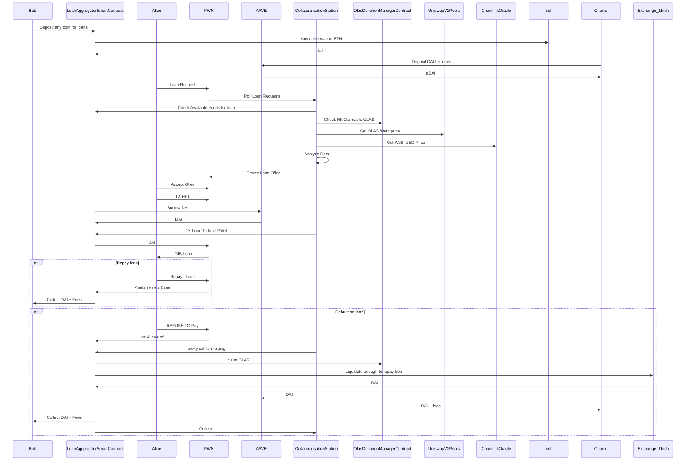

# Collatoralisation Station

Trustless liquidity for your autonomous agent service NFTs.

## Front-end

The [front-end](frontend)

## Smart contracts

The [smart contracts](onchain)

## Multi-agent system

The [multi-agent service](mas)

## Sequence diagram

The Collateralisation Station functions at its core by leveraging autonomous agent services, represented as an NFT, as collateral to access liquidity without requiring the sale of the NFT.
The Collateralisation Station, an Autonolas multi-agent system, checks the amount of claimable OLAS on the service NFT, as well as the current wETH price of OLAS on Uniswap, and the current price of wETH in USD using a Chainlink oracle.
This data is then analyzed, and a loan offer is created and forwarded to PWN.
Alice can then assess the offer, and if she accepts the offer, her NFT will be transferred to the PWN smart contract, and she receives her loan from PWN.
She can then either:
1. Repay the loan via PWN, which will subsequently be settled on the LoanAggregatorSmartContract, and her NFT is returned to her.
2. Refuse or fail to repay her loan. Then, a proxy call is made to the multi-agent service-owned SAFE multisig, and as much OLAS as is needed to cover the repayment of Bob + fees will be liquidated. The Collateralisation Station transfers these funds to the LoanAggregatorSmartContract, which is used to fulfill the repayment to PWN, at which point ownership of the NFT held in the PWN smart contract will be transferred to LoanAggregatorSmartContract.

Alternatively, or rather what's more, Charlie can donate any ERC20 token to the LoanAggregatorSmartContract, which will then be swapped via AAVE for ETH to obtain an interest-bearing aToken and collect fees. The deposited ERC20 token on AAVE can subsequently be borrowed by the LoanAggregatorSmartContract and similarly be used to lend out, via PWN, to Alice. The only difference here is that when Alice fails to repay, the Collateralisation Station liquidates as much as is needed to repay Charlie + fees, via AAVE.

