# Collateralisation Station

```mermaid
flowchart TD
  subgraph CollateralisationStationAbciApp
    PostTransactionRound ---> |DONE| PrepareUpdateRound
    PrepareUpdateRound ---> |DONE| PrepareUpdateTxSubmissionRound
    PrepareUpdateRound ---> |POST_UPDATE| CheckOutstandingLoansRound
    InitialiseRound ---> |DONE| CheckOutstandingLoansRound
    CheckOutstandingLoansRound ---> |LOAN_NOT_PAID| PrepareLiquidationRound
    PrepareLiquidationRound ---> |DONE| PrepareLiquidationTxSubmissionRound
    CheckOutstandingLoansRound ---> |DONE| CheckForLoanRequestsRound

    CheckForLoanRequestsRound ---> |ALREADY_OFFERED| FinishRound
    CheckForLoanRequestsRound ---> |LOAN_REQUESTS_EXIST| CheckAvailableFundsRound 
    CheckForLoanRequestsRound ---> |NO_LOANS_REQUESTS| FinishRound
    CheckAvailableFundsRound ---> |INSUFFICIENT_FUNDS| FinishRound
    CheckAvailableFundsRound ---> |SUFFICIENT_FUNDS| CheckValueOfCollateralRound
    CheckValueOfCollateralRound ---> |WORTHLESS_NFT| FinishRound
    CheckValueOfCollateralRound ---> |OFFERABLE_NFT| PrepareLoanOfferRound
    PrepareLoanOfferRound ---> |DONE| PrepareOfferTxSubmissionRound
  end
```




## Table of Contents

- [Collateralisation Station](#collateralisation-station)
  - [Table of Contents](#table-of-contents)
  - [Getting Started](#getting-started)
    - [Setup for Development](#setup-for-development)
  - [Commands](#commands)
    - [Formatting](#formatting)
    - [Linting](#linting)
    - [Testing](#testing)
    - [Locking](#locking)
    - [all](#all)
  - [License](#license)

## Getting Started

### Setup for Development

If you're looking to contribute or develop with `collateralisation_station`, get the source code and set up the environment:

```shell
git clone https://github.com/8ball030/collateralisation_station
cd collateralisation_station
poetry install && poetry shell
```

## Commands

Here are common commands you might need while working with the project:

### Formatting

```shell
make fmt
```

### Linting

```shell
make lint
```

### Testing

```shell
make test
```

### Locking

```shell
make hashes
```

### all

```shell
make all
```

## License

This project is licensed under the [Apache License 2.0](https://www.apache.org/licenses/LICENSE-2.0)

